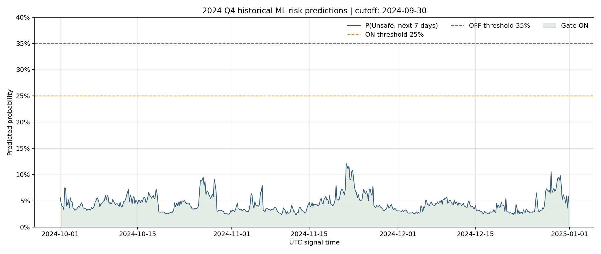

# 2024 Q4 ML 门控历史预测（信息截止 2024-09-30）

## 范围和口径

这是对 2024-10-01 至 2024-12-31 的历史点时回放。模型按项目预先设定的 Walk-Forward 第 11 折运行：24 个月训练、3 个月验证、3 个月测试；信号概率来自 LightGBM，校准采用训练期 purged OOF sigmoid。训练集为 2022-07-01 起的 4,344 个 4H 样本，验证期从 2024-07-01 起（510 个样本），测试期没有参与模型拟合、校准或阈值选择。训练与验证边界各 purge 42 根 4H K 线。

该折的最后训练样本为 2024-06-23 20:00 UTC；验证样本截至 2024-09-23 20:00 UTC，验证期仅用于评估，没有并入模型拟合。虽然策略信息截止设为 9 月 30 日，遵守预设 24/3/3 方案的模型并未在验证期结束后重训。

每个信号在完整 4H K 线收盘后生成，首个 5 分钟执行 bar 的时间戳与该 4H 收盘边界相同。目标为未来 42 根 4H K 线最低价相对当前收盘价是否下跌至少 12%。10 月 1 日 00:00 UTC 的第一条预测使用截至 9 月 30 日 23:55 的行情；其 P(Unsafe) 为 5.74%。CSV 后续行是逐 4H 更新的历史回放，使用每个预测时点之前的行情，不能在 9 月 30 日一次性预先得知。CSV 只含预测概率和状态，没有把未来实际标签放入信号文件。新 Cycle 在 2024-10-01 开始，门控状态按规则从 OFF 初始化。

## 预测结果

- 共 552 个 4H 预测，时间 2024-10-01T00:00:00+00:00 至 2024-12-31T20:00:00+00:00。
- P(Unsafe)：均值 4.44%，中位数 4.10%，范围 2.35%–12.10%。
- 552/552 个预测低于 25%；0 个高于 35%。以 OFF 初始状态运行时，首根 4H 仍为 OFF，第二根（2024-10-01 04:00 UTC）起门控转 ON，并在该季度余下时段保持 ON。
- 测试折指标：PR-AUC 0.0140，ROC-AUC 0.1293，Brier 0.0244；按 35% 判定阈值的 Unsafe Recall 0.00%、Precision 0.00%。
- 事后标签显示该季度有 13/552 根信号对应的未来 7 天触发 Unsafe（正例率 2.36%）。该标签只用于历史评估，不是当时可见信息。

| 月份 | 预测数 | 平均概率 | 最高概率 | >35%次数 | 门控ON数 | 门控OFF数 | 事后Unsafe标签数 |
|---|---:|---:|---:|---:|---:|---:|---:|
| 2024-10 | 186 | 4.62% | 9.54% | 0 | 185 | 1 | 0 |
| 2024-11 | 180 | 4.60% | 12.10% | 0 | 180 | 0 | 0 |
| 2024-12 | 186 | 4.10% | 10.57% | 0 | 186 | 0 | 13 |

## 使用边界

2024 Q4 已经结束，这些是历史模拟信号，不是当前可执行信号。该折的 Unsafe Recall 为 0%，门控整季基本保持 ON，未能展示其能否及时挡住危险行情；项目整体也未通过尾部风险门槛。现实口径资金费率与标记价格回测因 2023-11-10 缺 5 根官方样本外标记价格而被阻止，因此本输出不应作为实盘依据。Binance 说明未实现盈亏和清算参考标记价格，且保证金要求随持仓规模变化；这里的 OHLCV 门控概率不能替代账户级风险计算。[Binance Futures Liquidation Protocols](https://www.binance.com/en/support/faq/detail/360033525271)

逐根预测见 `ml_predictions_2024Q4_asof_20240930.csv`。历史模型结果与完整回测见 `RESULTS.md`。
