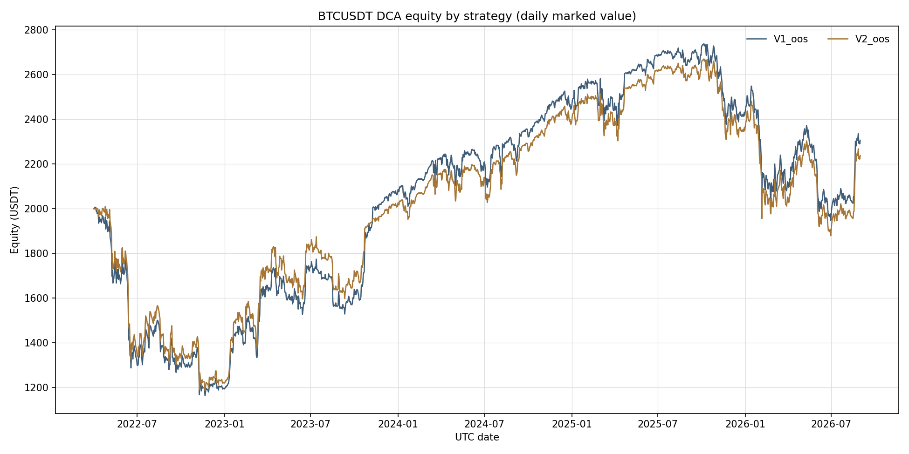
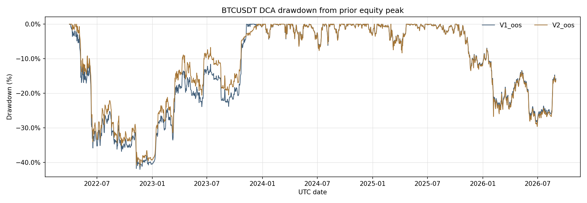
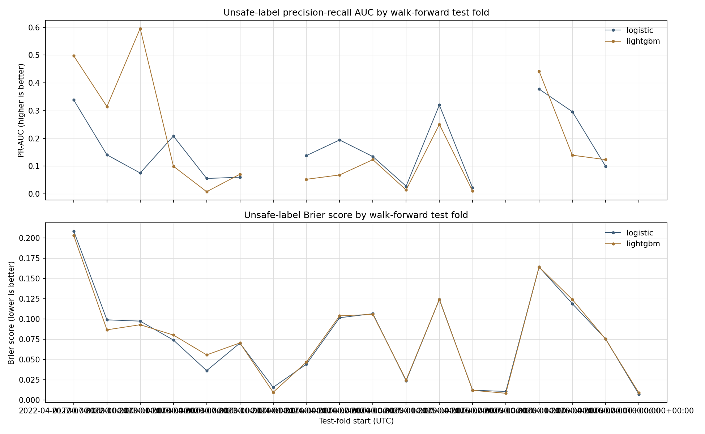
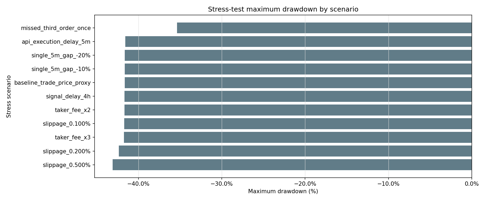

# BTCUSDT 4H ML-Gated DCA 回测结果

## 结论

研究门槛：**V3 未运行：样本外仍有 5 根官方标记价格缺失**。规则要求现实成本口径下 V3 相对 V1 同时改善最差单轮收益和最大回撤，并且模拟强平次数为零。该判断只适用于本报告覆盖的数据和模拟假设。

比较期：2022-04-01 至 2026-08-31。V1_full 另覆盖全部输入历史。V1/V2 使用相同手续费和滑点；本次缺少样本外官方标记价格，因此 V1_realistic/V3_realistic 未运行。已下载并校验资金费率数据，但未向本次 V1/V2 结果计入资金费率。

按照回测约定，缺少官方标记价格时阻止 V3 和 V1_realistic；本次结果无法判定 ML 是否通过现实口径研究门槛。

共同样本外代理口径下，V1 收益 15.330%、最大回撤 -42.528%、最差单轮 -15.802%；V2 分别为 11.913%、-41.631%、-16.206%。V2 对 V1 的收益差为 -3.417%，回撤差为 0.897%，最差单轮差为 -0.404%。该代理比较没有资金费率和官方标记价格风险计算。

LightGBM 样本外最大 Unsafe 概率为 32.116%；按 35% 关闭阈值，V2 全部 5 分钟执行时段中的 ML OFF 占比为 0.609%。概率未达到关闭阈值，开关几乎全程保持 ON，不能把本次差异解释为充分启停过滤的证据。

## 数据质量

- OHLCV：701,280 根 5 分钟 K 线，80 个月，2020-01-01T00:00:00+00:00 至 2026-08-31T23:55:00+00:00。
- 标记价格：701,266 根有效记录；原始归档有 14 根缺值。
- 资金费率：7,305 条；费率间隔小时值：[8.0]。
- 校验：OHLCV 缺口 0、重复 0、异常 OHLC 0；标记价格缺失值 14 根，其中样本外 5 根。
- 日档修复：已核验并补入 2592 根官方标记价格；剩余缺失的时间戳列在 `data_quality.json`。
- Binance SHA-256 校验：OHLCV 80 个月、标记价格 80 个月、资金费率 80 个月。

Unsafe 标签正例率：11.930%。输入来源与校验结果见 `data_quality.json`。

## 策略对比

| 策略 | 指标 | 数值 |
|---|---|---:|
| V1_full | Total return | -8.745% |
| V1_full | CAGR | -1.363% |
| V1_full | Max drawdown | -45.223% |
| V1_full | Sharpe | 0.091 |
| V1_full | Sortino | 0.130 |
| V1_full | Calmar | -0.030 |
| V1_full | Cycle net profit factor | 0.885 |
| V1_full | Worst cycle return | -45.186% |
| V1_full | Max SO depth | 5 |
| V1_full | Max notional / overall initial equity | 1.208 |
| V1_full | Max cycle notional / cycle start equity | 0.798 |
| V1_full | Time in market | 35.438% |
| V1_full | ML OFF share | — |
| V1_full | Ambiguous 5m bars | 274 |
| V1_full | Equity floor hits | 1 |
| V1_full | Risk exits | 1 |
| V1_full | Modeled liquidations | 0 |
| V1_full | Fees (USDT) | 162.169 |
| V1_full | Slippage cost (USDT) | 162.169 |
| V1_full | Funding cost (USDT) | 0.000 |
| V1_oos | Total return | 15.330% |
| V1_oos | CAGR | 3.280% |
| V1_oos | Max drawdown | -42.528% |
| V1_oos | Sharpe | 0.254 |
| V1_oos | Sortino | 0.361 |
| V1_oos | Calmar | 0.077 |
| V1_oos | Cycle net profit factor | 1.694 |
| V1_oos | Worst cycle return | -15.802% |
| V1_oos | Max SO depth | 5 |
| V1_oos | Max notional / overall initial equity | 0.751 |
| V1_oos | Max cycle notional / cycle start equity | 0.748 |
| V1_oos | Time in market | 99.009% |
| V1_oos | ML OFF share | — |
| V1_oos | Ambiguous 5m bars | 144 |
| V1_oos | Equity floor hits | 0 |
| V1_oos | Risk exits | 0 |
| V1_oos | Modeled liquidations | 0 |
| V1_oos | Fees (USDT) | 81.710 |
| V1_oos | Slippage cost (USDT) | 81.709 |
| V1_oos | Funding cost (USDT) | 0.000 |
| V2_oos | Total return | 11.913% |
| V2_oos | CAGR | 2.580% |
| V2_oos | Max drawdown | -41.631% |
| V2_oos | Sharpe | 0.229 |
| V2_oos | Sortino | 0.324 |
| V2_oos | Calmar | 0.062 |
| V2_oos | Cycle net profit factor | 1.446 |
| V2_oos | Worst cycle return | -16.206% |
| V2_oos | Max SO depth | 5 |
| V2_oos | Max notional / overall initial equity | 0.792 |
| V2_oos | Max cycle notional / cycle start equity | 0.787 |
| V2_oos | Time in market | 98.334% |
| V2_oos | ML OFF share | 0.609% |
| V2_oos | Ambiguous 5m bars | 154 |
| V2_oos | Equity floor hits | 0 |
| V2_oos | Risk exits | 0 |
| V2_oos | Modeled liquidations | 0 |
| V2_oos | Fees (USDT) | 83.725 |
| V2_oos | Slippage cost (USDT) | 83.725 |
| V2_oos | Funding cost (USDT) | 0.000 |

## 分期样本外策略结果

各期收益与回撤取自同一条连续样本外资金曲线；期初权益使用该期开始前一根 5 分钟 K 线的收盘权益，首期使用 2,000 USDT。策略状态与持仓不在测试期边界重置。最差单轮列出该期结束的已完成 Cycle，跨期未结束的 Cycle 不计入该列。

| Fold | Test window | V1 return | V2 return | V2 − V1 return | V1 max DD | V2 max DD | V2 − V1 DD | V1 worst closed cycle | V2 worst closed cycle |
|---:|---|---:|---:|---:|---:|---:|---:|---:|---:|
| 1 | 2022-04-01 → 2022-07-01 | -33.765% | -31.611% | 2.154% | -38.520% | -37.121% | 1.399% | 0.101% | 0.180% |
| 2 | 2022-07-01 → 2022-10-01 | -1.507% | -1.646% | -0.140% | -17.623% | -19.022% | -1.399% | — | — |
| 3 | 2022-10-01 → 2023-01-01 | -8.591% | -9.400% | -0.809% | -16.560% | -18.023% | -1.463% | — | — |
| 4 | 2023-01-01 → 2023-04-01 | 38.970% | 43.023% | 4.053% | -14.399% | -15.538% | -1.139% | — | — |
| 5 | 2023-04-01 → 2023-07-01 | 4.719% | 5.062% | 0.343% | -13.512% | -14.437% | -0.924% | — | — |
| 6 | 2023-07-01 → 2023-10-01 | -7.885% | -8.431% | -0.546% | -15.105% | -16.120% | -1.015% | — | — |
| 7 | 2023-10-01 → 2024-01-01 | 29.206% | 19.869% | -9.337% | -4.684% | -5.024% | -0.340% | -0.305% | -4.883% |
| 8 | 2024-01-01 → 2024-04-01 | 7.894% | 7.446% | -0.448% | -5.645% | -5.508% | 0.138% | -0.108% | -0.111% |
| 9 | 2024-04-01 → 2024-07-01 | -0.941% | -0.971% | -0.030% | -7.584% | -7.824% | -0.240% | 0.054% | 0.056% |
| 10 | 2024-07-01 → 2024-10-01 | 6.170% | 6.608% | 0.439% | -11.126% | -10.634% | 0.492% | 0.010% | 0.050% |
| 11 | 2024-10-01 → 2025-01-01 | 4.624% | 4.586% | -0.038% | -3.808% | -3.913% | -0.105% | 0.058% | 0.060% |
| 12 | 2025-01-01 → 2025-04-01 | -0.437% | -0.449% | -0.012% | -8.334% | -8.558% | -0.223% | 0.113% | 0.116% |
| 13 | 2025-04-01 → 2025-07-01 | 10.038% | 10.293% | 0.255% | -6.446% | -6.625% | -0.179% | 0.050% | 0.051% |
| 14 | 2025-07-01 → 2025-10-01 | 0.007% | 0.007% | 0.000% | -3.294% | -3.379% | -0.085% | 0.017% | 0.017% |
| 15 | 2025-10-01 → 2026-01-01 | -9.976% | -10.236% | -0.260% | -15.320% | -15.711% | -0.391% | 0.133% | 0.136% |
| 16 | 2026-01-01 → 2026-04-01 | -12.315% | -12.673% | -0.358% | -22.942% | -23.571% | -0.629% | — | — |
| 17 | 2026-04-01 → 2026-07-01 | -8.178% | -8.450% | -0.272% | -18.495% | -19.041% | -0.546% | — | — |
| 18 | 2026-07-01 → 2026-09-01（部分期） | 18.433% | 19.103% | 0.670% | -3.967% | -4.101% | -0.134% | — | — |

完整逐期数字与 Cycle 计数见 `oos_period_comparison.csv`。

## 模型逐期结果

| 模型 | 测试折数 | Unsafe Recall (>35%) | Unsafe Precision (>35%) | PR-AUC | ROC-AUC | Brier |
|---|---:|---:|---:|---:|---:|---:|
| lightgbm | 18 | 0.000% | 0.000% | 0.187 | 0.546 | 0.077 |
| logistic | 18 | 0.000% | 0.000% | 0.166 | 0.617 | 0.077 |

前十个平均 LightGBM 分裂重要度：

- `ema50_gap`: mean LightGBM split importance 429.6
- `vol_42`: mean LightGBM split importance 247.4
- `atr14_pct`: mean LightGBM split importance 164.9
- `ema20_gap`: mean LightGBM split importance 151.9
- `adx14`: mean LightGBM split importance 145.3
- `vol_18`: mean LightGBM split importance 133.2
- `ret_42`: mean LightGBM split importance 124.1
- `ema200_gap`: mean LightGBM split importance 106.9
- `obv_slope_18`: mean LightGBM split importance 92.9
- `macd_hist_pct`: mean LightGBM split importance 88.4

## 压力测试

压力情景在最长样本外持仓 Cycle 中点，将单根 5 分钟 K 线改为从前收盘价下跌 10% 或 20% 并收于低点，后续恢复原行情；延迟、漏单和交易成本按场景名执行。若 V3 被阻止，本表基于 V2 与成交价风险代理，不能替代标记价格风控压力测试。

| 场景 | Total return | Max drawdown | Worst cycle return | 模拟强平 | 风控退出 |
|---|---:|---:|---:|---:|---:|
| baseline_trade_price_proxy | 11.913% | -41.631% | -16.206% | 0 | 0 |
| taker_fee_x2 | 8.404% | -41.679% | -15.532% | 0 | 0 |
| taker_fee_x3 | 9.075% | -41.727% | -12.046% | 0 | 0 |
| slippage_0.100% | 10.492% | -41.708% | -15.305% | 0 | 0 |
| slippage_0.200% | 4.986% | -42.348% | -14.496% | 0 | 0 |
| slippage_0.500% | -10.033% | -43.090% | -15.333% | 0 | 0 |
| signal_delay_4h | 11.787% | -41.676% | -16.221% | 0 | 0 |
| api_execution_delay_5m | 11.432% | -41.587% | -16.393% | 0 | 0 |
| missed_third_order_once | 12.136% | -35.357% | -16.179% | 0 | 0 |
| single_5m_gap_-10% | 11.913% | -41.631% | -16.206% | 0 | 0 |
| single_5m_gap_-20% | 11.913% | -41.631% | -16.206% | 0 | 0 |

## 口径与限制

- 只用已收盘 4H OHLCV 生成预测；订单从下一根 5 分钟 K 线开始执行。标签为后续 42 根 4H 最低价相对当前收盘价下跌至少 12%。测试集不参与模型选择、概率校准或阈值设置。
- 初始权益 2,000 USDT；每边 taker 费率 0.05%、滑点 0.05%；交易所杠杆设置 3x。资金费率归档已通过校验，但因官方标记价格缺失，现实口径策略未运行；V1/V2 与其压力测试不含资金费率，`funding_cost=0`。不得将这些结果视为全成本结果。
- 历史账户专属维持保证金档位无法从公开数据恢复。报告以 1% 研究假设估算维持保证金比率；模拟强平为零不代表所有实际账户或极端成交下不会强平。
- 5 分钟 K 线无法还原 K 线内部真实成交先后。报告对同根 K 线多层 SO 触发和止盈碰撞使用固定保守顺序，并保存相关标记。
- 回测结果是研究证据，不构成实盘收益或安全保证。TradingView 原策略 V0 未提供，因此本报告不声称复现 V0。

## 可复查文件

- `strategy_comparison.csv`：全周期与共同样本外策略指标。
- `V1_full_equity.parquet`, `V1_oos_equity.parquet`, `V2_oos_equity.parquet`：逐 5 分钟权益与持仓。
- `V1_full_trades.csv` / `V1_full_cycles.csv`, `V1_oos_trades.csv` / `V1_oos_cycles.csv`, `V2_oos_trades.csv` / `V2_oos_cycles.csv`：逐笔订单/费用/盈亏与单轮结果。
- `oos_predictions.parquet`、`walk_forward_metrics.csv`、`lightgbm_feature_importance.csv`：逐期预测、分类表现及特征重要度。
- `oos_period_comparison.csv`：连续样本外曲线按 Walk-Forward 测试窗口的收益、回撤与已完成 Cycle 归因。
- `stress_results.csv`：各压力情景结果。
- `features_4h.parquet`：特征、前瞻标签及 4H 行情。
